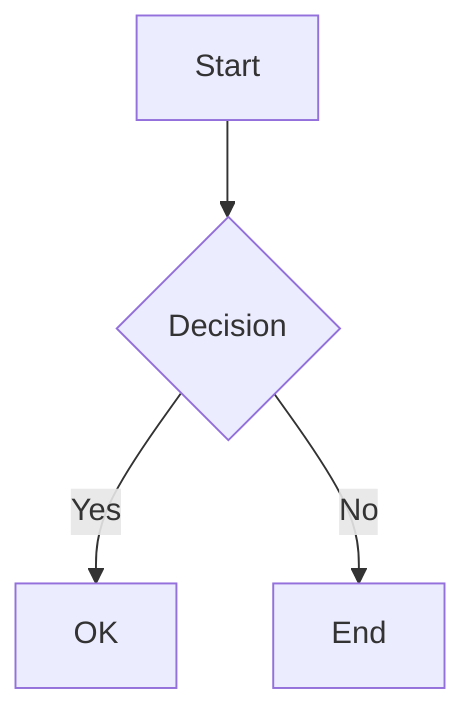

# Fumadocs 兼容模式 PRD

> **版本**: v2.2  
> **最后更新**: 2024-12-24  
> **状态**: 设计稿  
> **测试数据源**: DocEngineering (git submodule)

---

## 1. 问题陈述

### 1.1 现状

Fumadocs 使用 `fumadocs-mdx` 解析标准 MDX 文件，要求：
- 完整的 frontmatter（title, description 等）
- MDX 语法规范（JSX 兼容）
- 通过 `source.config.ts` 集中配置

### 1.2 痛点

当用户想要快速发布现有的 markdown 文档集合时（如：API 文档、工程规范、知识库），会遇到：

1. **格式不兼容** - 原生 markdown 包含 MDX 解析器不支持的语法
2. **缺少 frontmatter** - 需要手动为每个文件添加元数据
3. **链接断裂** - 相对路径 `./other.md` 无法自动转换为正确的 URL
4. **污染核心架构** - 兼容处理逻辑如果混入主渲染管道，会影响正常 MDX 的性能和可靠性
5. **特殊目录被忽略** - 如 `.promptpack/actions` 中的文档无法渲染

### 1.3 目标

创建一个**完全隔离**的兼容层引擎，让用户可以：
- 零配置发布现有 markdown 文档
- 不影响主 MDX 渲染管道的稳定性
- 优雅降级处理各种边缘语法
- 可选渲染特殊目录（如 `.promptpack/`）

---

## 2. 架构设计

### 2.1 核心隔离原则

```
┌─────────────────────────────────────────────────────────────────┐
│                        Fumadocs 主架构                           │
│  ┌────────────────────────────────────────────────────────────┐ │
│  │  source.config.ts → fumadocs-mdx → DocsLayout → /docs/*    │ │
│  │  (严格 MDX, frontmatter 必需, 编译时处理)                   │ │
│  └────────────────────────────────────────────────────────────┘ │
│                              ↕ 完全隔离                          │
│  ┌────────────────────────────────────────────────────────────┐ │
│  │  compat-engine → mdx-remote → DocsLayout → /raw-notes/*    │ │
│  │  (宽松 markdown, 自动元数据, 运行时编译)                    │ │
│  └────────────────────────────────────────────────────────────┘ │
└─────────────────────────────────────────────────────────────────┘
```

### 2.2 隔离边界

| 层面 | 主架构 (MDX) | 兼容层 (Compat) | 隔离方式 |
| --- | --- | --- | --- |
| **配置文件** | `source.config.ts` | 独立配置（代码内配置） | 不共享配置 |
| **源解析器** | `fumadocs-mdx/config` | `compat-engine/*` 模块 | 独立模块 |
| **编译时机** | 构建时 (SSG) | 运行时/请求时 | 不同生命周期 |
| **URL 命名空间** | `/docs/*` | `/raw-notes/*` (可配置) | 路由隔离 |
| **页面树** | 共享 DocsLayout | 独立 pageTree | 导航隔离 |
| **错误处理** | 严格（构建失败） | 宽松（优雅降级） | 不同策略 |

### 2.3 模块化设计（避免上帝对象）

```
compat-engine/
├── index.ts              # 公共 API 入口，只暴露 createCompatSource
├── scanner.ts            # 文件扫描模块
├── preprocessor.ts       # Markdown 预处理模块
├── metadata.ts           # 元数据提取模块
├── link-transformer.ts   # 链接转换模块
├── tree-builder.ts       # 页面树构建模块
└── types.ts              # 类型定义
```

#### 2.3.1 模块职责

| 模块 | 职责 | 输入 | 输出 |
| --- | --- | --- | --- |
| `scanner` | 递归扫描目录，过滤文件 | `dir`, `options` | `string[]` 文件路径列表 |
| `preprocessor` | 转义 JSX 敏感字符 | `content` | 处理后的 `content` |
| `metadata` | 提取 title/description | `content`, `filePath` | `{ title, description }` |
| `link-transformer` | 转换相对链接 | `content`, `baseUrl` | 处理后的 `content` |
| `tree-builder` | 构建页面树 | `pages[]` | `Root` 页面树 |

#### 2.3.2 数据流

```
┌─────────────┐
│   scanner   │──► 文件路径列表
└─────────────┘
       │
       ▼
┌─────────────┐     ┌───────────────┐     ┌───────────────────┐
│  读取文件    │──►  │  preprocessor │──►  │  link-transformer │
└─────────────┘     └───────────────┘     └───────────────────┘
       │                                           │
       ▼                                           ▼
┌─────────────┐                            ┌──────────────┐
│  metadata   │                            │  RawPage 对象 │
└─────────────┘                            └──────────────┘
                                                   │
                                                   ▼
                                           ┌──────────────┐
                                           │ tree-builder │
                                           └──────────────┘
                                                   │
                                                   ▼
                                           ┌──────────────┐
                                           │ CompatSource │
                                           └──────────────┘
```

### 2.4 插件架构设计

为确保扩展性和可维护性，compat-engine 采用**管道式插件架构**。

#### 2.4.1 设计原则

1. **单一职责**: 每个插件只做一件事
2. **可组合**: 插件可以自由组合
3. **可替换**: 内置插件可被自定义插件替换
4. **无副作用**: 插件是纯函数，便于测试

#### 2.4.2 插件类型

```typescript
// ==================== 核心插件接口 ====================

/**
 * 内容转换插件 - 处理 markdown 内容
 * 在渲染前对内容进行转换
 */
interface ContentPlugin {
  name: string;
  /**
   * 转换优先级（数字越小越先执行）
   * 推荐范围: 0-100
   * - 0-30: 预处理（如 JSX 转义）
   * - 31-60: 内容转换（如链接转换）
   * - 61-100: 后处理
   */
  priority: number;
  /**
   * 转换函数
   * @param content - 原始/上一步处理后的内容
   * @param context - 上下文信息
   * @returns 转换后的内容
   */
  transform: (content: string, context: PluginContext) => string | Promise<string>;
}

/**
 * 元数据插件 - 提取或增强元数据
 */
interface MetadataPlugin {
  name: string;
  priority: number;
  /**
   * 提取/增强元数据
   * @param metadata - 当前元数据
   * @param content - 文件内容
   * @param context - 上下文信息
   * @returns 增强后的元数据
   */
  extract: (
    metadata: PageMetadata,
    content: string,
    context: PluginContext
  ) => PageMetadata | Promise<PageMetadata>;
}

/**
 * 扫描插件 - 自定义文件过滤逻辑
 */
interface ScannerPlugin {
  name: string;
  priority: number;
  /**
   * 过滤文件
   * @param filePath - 相对文件路径
   * @param context - 上下文信息
   * @returns true = 包含, false = 排除, undefined = 交给下一个插件
   */
  filter: (filePath: string, context: PluginContext) => boolean | undefined;
}

/**
 * 页面树插件 - 自定义页面树构建
 */
interface TreePlugin {
  name: string;
  priority: number;
  /**
   * 转换页面树节点
   * @param node - 当前节点
   * @param context - 上下文信息
   * @returns 转换后的节点
   */
  transform: (node: TreeNode, context: TreeContext) => TreeNode;
}

/**
 * 插件上下文
 */
interface PluginContext {
  /** 当前文件路径 */
  filePath: string;
  /** 基础 URL */
  baseUrl: string;
  /** 源目录 */
  sourceDir: string;
  /** 其他配置 */
  options: CompatSourceOptions;
}

interface PageMetadata {
  title: string;
  description: string;
  frontmatter: Record<string, unknown>;
  [key: string]: unknown;  // 允许插件添加自定义字段
}
```

#### 2.4.3 内置插件

| 类型 | 插件名 | 优先级 | 职责 |
| --- | --- | --- | --- |
| Content | `jsx-escape` | 10 | 转义 JSX 敏感字符 |
| Content | `link-transform` | 40 | 转换相对链接 |
| Content | `image-transform` | 41 | 转换图片路径 |
| Metadata | `frontmatter` | 10 | 解析 frontmatter |
| Metadata | `heading` | 20 | 从 H1 提取标题 |
| Metadata | `filename` | 30 | 从文件名生成标题 |
| Scanner | `extension-filter` | 10 | 只保留 .md/.mdx |
| Scanner | `ignore-pattern` | 20 | 应用 ignore 模式 |
| Scanner | `include-pattern` | 15 | 应用 include 模式 |

#### 2.4.4 插件管道执行

```
┌──────────────────────────────────────────────────────────────────┐
│                        Content Pipeline                           │
│  ┌─────────────┐    ┌─────────────┐    ┌─────────────┐           │
│  │ jsx-escape  │ -> │link-transform│ -> │image-transform│ -> ... │
│  │ (priority:10)│    │ (priority:40)│    │ (priority:41) │       │
│  └─────────────┘    └─────────────┘    └─────────────┘           │
└──────────────────────────────────────────────────────────────────┘

执行顺序: 按 priority 升序排列
```

#### 2.4.5 使用示例

```typescript
import { createCompatSource, defineContentPlugin } from './compat-engine';

// 自定义插件：添加阅读时间
const readingTimePlugin = defineContentPlugin({
  name: 'reading-time',
  priority: 50,
  transform: (content, context) => {
    // 在内容末尾添加阅读时间提示
    const words = content.split(/\s+/).length;
    const readingTime = Math.ceil(words / 200);
    return content + `\n\n---\n*阅读时间: ${readingTime} 分钟*`;
  },
});

// 自定义插件：自定义元数据
const customMetadataPlugin = defineMetadataPlugin({
  name: 'custom-metadata',
  priority: 40,
  extract: (metadata, content, context) => {
    return {
      ...metadata,
      category: context.filePath.split('/')[0],
      readingTime: Math.ceil(content.split(/\s+/).length / 200),
    };
  },
});

// 使用插件
const source = await createCompatSource({
  dir: 'DocEngineering',
  baseUrl: '/compat',
  plugins: {
    content: [readingTimePlugin],
    metadata: [customMetadataPlugin],
    // scanner: [],
    // tree: [],
  },
});
```

#### 2.4.6 禁用/替换内置插件

```typescript
const source = await createCompatSource({
  dir: 'docs',
  baseUrl: '/docs',
  plugins: {
    // 禁用内置的 jsx-escape 插件
    content: [
      { name: 'jsx-escape', enabled: false },
      myCustomEscapePlugin,
    ],
  },
});
```

#### 2.4.7 文件结构更新

```
compat-engine/
├── index.ts              # 公共 API
├── types.ts              # 类型定义（包含插件接口）
├── core/
│   ├── pipeline.ts       # 插件管道执行器
│   └── context.ts        # 上下文构建
├── plugins/
│   ├── content/
│   │   ├── jsx-escape.ts
│   │   ├── link-transform.ts
│   │   └── image-transform.ts
│   ├── metadata/
│   │   ├── frontmatter.ts
│   │   ├── heading.ts
│   │   └── filename.ts
│   ├── scanner/
│   │   ├── extension-filter.ts
│   │   ├── ignore-pattern.ts
│   │   └── include-pattern.ts
│   └── index.ts          # 内置插件导出
├── scanner.ts            # 扫描器（使用 Scanner 插件）
├── preprocessor.ts       # 预处理器（使用 Content 插件）
├── metadata.ts           # 元数据提取器（使用 Metadata 插件）
├── link-transformer.ts   # 链接转换（作为 Content 插件）
└── tree-builder.ts       # 页面树构建（使用 Tree 插件）
```

---

## 3. 核心功能规格

### 3.1 文件过滤

| 规则 | 行为 | 原因 |
| --- | --- | --- |
| 只处理 `.md` / `.mdx` | 其他扩展名完全忽略 | 聚焦文档渲染 |
| 忽略 `_` 开头文件 | `_draft.md` 不渲染 | 草稿/私有文件 |
| **可选**忽略 `.` 开头目录 | 通过 `include` 配置覆盖 | 支持特殊目录 |
| 忽略超过 10MB 文件 | 警告并跳过 | 防止内存问题 |

### 3.2 特殊目录支持

#### 3.2.1 问题

DocEngineering 中存在 `.promptpack/actions/` 目录，包含 27 个重要的 markdown 文件。默认情况下，以 `.` 开头的目录会被忽略。

#### 3.2.2 解决方案：`include` 配置

```typescript
interface CompatSourceOptions {
  // ...
  
  /**
   * 显式包含的目录或文件模式
   * 优先级高于 ignore 规则
   * 例如: ['.promptpack/**'] 将包含 .promptpack 目录下的所有文件
   */
  include?: string[];
}
```

#### 3.2.3 使用示例

```typescript
createCompatSource({
  dir: 'DocEngineering',
  baseUrl: '/compat',
  ignore: ['_*', 'tests/*'],  // 忽略草稿和测试
  include: ['.promptpack/**'], // 但包含 .promptpack 目录
});
```

### 3.3 多级目录支持

#### 3.3.1 需求

DocEngineering 结构包含多级嵌套：

```
DocEngineering/
├── AGENTS.md
├── reference/
│   ├── 0-disc-analyze-project.md
│   └── ... (36 files)
├── docs/
│   ├── CONTENT_TODO.md
│   └── multi-agent-review.md
├── facts/
│   └── README.md
└── .promptpack/
    └── actions/
        ├── 0-disc-audience-intent.md
        └── ... (27 files)
```

#### 3.3.2 URL 映射规则

| 文件路径 | URL |
| --- | --- |
| `AGENTS.md` | `/compat/agents` |
| `reference/0-disc-analyze-project.md` | `/compat/reference/0-disc-analyze-project` |
| `docs/CONTENT_TODO.md` | `/compat/docs/content-todo` |
| `.promptpack/actions/0-disc-audience-intent.md` | `/compat/promptpack/actions/0-disc-audience-intent` |

**注意**：`.promptpack` 映射为 `promptpack`（去掉前导点）

#### 3.3.3 页面树结构

```typescript
{
  name: 'Documents',
  children: [
    { type: 'page', name: 'Agents', url: '/compat/agents' },
    {
      type: 'folder',
      name: 'Reference',
      children: [
        { type: 'page', name: '0-DISC Analyze Project', url: '/compat/reference/0-disc-analyze-project' },
        // ...
      ]
    },
    {
      type: 'folder',
      name: 'Promptpack',
      children: [
        {
          type: 'folder',
          name: 'Actions',
          children: [
            { type: 'page', name: '0-DISC Audience Intent', url: '/compat/promptpack/actions/0-disc-audience-intent' },
            // ...
          ]
        }
      ]
    }
  ]
}
```

### 3.4 元数据自动提取

```typescript
interface ExtractedMetadata {
  title: string;       // 优先级: frontmatter.title > # 标题 > 文件名
  description: string; // 优先级: frontmatter.description > 首段文本 > 默认值
}
```

**标题提取规则**：
1. 检查 frontmatter 中的 `title` 字段
2. 扫描第一个 `# ` 开头的行
3. 将文件名转换为标题格式（`my-doc.md` → `My Doc`）

**描述提取规则**：
1. 检查 frontmatter 中的 `description` 字段
2. 取第一段非标题、非代码块的文本（前 200 字符）
3. 回退到 `"No description available"`

### 3.5 特殊语法处理

#### 3.5.1 JSX 敏感字符

| 输入 | 输出 | 上下文 |
| --- | --- | --- |
| `<16Ω` | `&lt;16Ω` | 表格单元格 |
| `{variable}` | `\{variable\}` | 非代码区域 |
| `<Component />` | 保持不变 | 有效 JSX 标签 |
| `` `<code>` `` | 保持不变 | 内联代码 |

**处理策略**：
```
1. 识别受保护区域（代码块、内联代码、数学公式）
2. 只在非受保护区域进行转义
3. 表格行内更激进转义（因为常见数据包含 < >）
```

#### 3.5.2 相对链接转换

```markdown
<!-- 输入 -->
[See other doc](./guides/setup.md)
[Parent doc](../readme.md)

<!-- 输出（假设 baseUrl = /raw-notes） -->
[See other doc](/raw-notes/guides/setup)
[Parent doc](/raw-notes/readme)
```

**规则**：
- 以 `.` 开头的 `.md`/`.mdx` 链接 → 转换为 URL 路径
- `http://`、`https://`、`#` 开头 → 保持不变
- `/` 开头的绝对路径 → 保持不变

#### 3.5.3 Mermaid 图表支持

```markdown

```

**处理策略**：
- 使用 `remarkMdxMermaid` 插件
- 转换为 `<Mermaid>` 组件
- 提供 `<Mermaid>` 组件实现（客户端渲染）

#### 3.5.4 数学公式支持

```markdown
行内公式: $E = mc^2$
块级公式:
$$
\sum_{i=1}^{n} x_i
$$
```

**处理策略**：
- 使用 `remark-math` + `rehype-katex`
- 引入 KaTeX CSS
- 保护公式内容不被 JSX 转义处理

#### 3.5.5 GFM 扩展

| 语法 | 支持状态 | 实现方式 |
| --- | --- | --- |
| 表格 | ✅ | remark-gfm |
| 任务列表 | ✅ | remark-gfm |
| 删除线 | ✅ | remark-gfm |
| 自动链接 | ✅ | remark-gfm |
| 脚注 | ⚠️ 可选 | remark-footnotes |

### 3.6 索引文件优先级

1. `README.md` / `readme.md`
2. `index.md` / `index.mdx`
3. 其他文件按字母顺序

**索引文件行为**：
- 如果目录存在 README.md，它作为该目录的 index 页面
- URL 路径为 `/path/to/folder`（不带 /readme）
- 侧边栏中显示为文件夹链接

---

## 4. 配置接口

### 4.1 类型定义

```typescript
interface CompatSourceOptions {
  // 必需
  dir: string;           // 内容目录路径（相对于项目根目录）
  baseUrl: string;       // URL 基础路径

  // 文件过滤
  extensions?: string[]; // 默认 ['.md', '.mdx']
  indexFiles?: string[]; // 默认 ['README.md', 'readme.md', 'index.md', 'index.mdx']
  ignore?: string[];     // 默认 ['_*'] - 匹配以 _ 开头的文件
  include?: string[];    // 显式包含的模式（覆盖 ignore），默认 []
  maxFileSize?: number;  // 默认 10MB

  // 链接处理
  transformLinks?: boolean;  // 默认 true - 转换相对 .md 链接
  imageBasePath?: string;    // 图片相对路径的基础目录

  // 插件配置（新增）
  plugins?: {
    content?: (ContentPlugin | PluginOverride)[];
    metadata?: (MetadataPlugin | PluginOverride)[];
    scanner?: (ScannerPlugin | PluginOverride)[];
    tree?: (TreePlugin | PluginOverride)[];
  };

  // 自定义处理（向后兼容，推荐使用 plugins）
  titleExtractor?: (content: string, filePath: string) => string;
  descriptionExtractor?: (content: string, filePath: string) => string;
  preprocessor?: (content: string, filePath: string) => string;
}

// 用于禁用或配置内置插件
interface PluginOverride {
  name: string;
  enabled?: boolean;
  options?: Record<string, unknown>;
}
```

### 4.2 使用示例

```typescript
// src/lib/compat-source.ts
import { createCompatSource } from './compat-engine';

export async function getCompatSource() {
  return createCompatSource({
    dir: 'DocEngineering',
    baseUrl: '/compat',
    transformLinks: true,
    ignore: ['_*', 'tests/*', 'scripts/*'],
    include: ['.promptpack/**'],  // 包含 .promptpack 目录
  });
}
```

---

## 5. 测试策略（TDD）

### 5.1 测试矩阵

#### 5.1.1 Scanner 模块测试

| 测试用例 | 输入 | 预期输出 |
| --- | --- | --- |
| 空目录 | `empty/` | `[]` |
| 单个文件 | `single/file.md` | `['file.md']` |
| 多级目录 | `a/b/c/file.md` | `['a/b/c/file.md']` |
| 忽略 _ 开头 | `_draft.md` | 不包含 |
| 默认忽略 . 开头 | `.hidden/file.md` | 不包含 |
| include 覆盖 | `.promptpack/**` | 包含 `.promptpack/` 下文件 |
| 混合扩展名 | `file.md`, `file.yaml` | 只返回 `file.md` |
| 超大文件 | >10MB | 不包含，记录警告 |

#### 5.1.2 Preprocessor 模块测试

| 测试用例 | 输入 | 预期输出 |
| --- | --- | --- |
| 表格中 `<` | `| <16Ω |` | `| &lt;16Ω |` |
| 代码块中 `<` | `` `<tag>` `` | `` `<tag>` `` (不变) |
| 花括号转义 | `{var}` | `\{var\}` |
| 有效 JSX 保留 | `<Component />` | `<Component />` |
| 数学公式保护 | `$<x>$` | `$<x>$` (不变) |
| 块级公式保护 | `$$\n<x>\n$$` | 不变 |

#### 5.1.3 Metadata 模块测试

| 测试用例 | 输入 | 预期 title |
| --- | --- | --- |
| frontmatter title | `title: Hello` | `Hello` |
| H1 标题 | `# World` | `World` |
| 文件名回退 | `my-doc.md` (无标题) | `My Doc` |
| 复杂 H1 | `# [0-DISC] Analysis` | `[0-DISC] Analysis` |

#### 5.1.4 Link-Transformer 模块测试

| 测试用例 | 输入 | 预期输出 |
| --- | --- | --- |
| 相对 .md 链接 | `[x](./other.md)` | `[x](/base/other)` |
| 父目录链接 | `[x](../readme.md)` | `[x](/base/readme)` |
| 绝对路径 | `[x](/root/file.md)` | 不变 |
| 外部链接 | `[x](https://...)` | 不变 |
| 锚点链接 | `[x](#section)` | 不变 |
| 非 md 链接 | `[x](./file.pdf)` | 不变 |

#### 5.1.5 Tree-Builder 模块测试

| 测试用例 | 输入页面 | 预期树结构 |
| --- | --- | --- |
| 单页面 | `['index']` | 根节点 + 1 page |
| 嵌套页面 | `['a/b/c']` | 3 层 folder |
| README 作为 index | `['folder/README']` | folder 有 index 属性 |
| 排序 | `['z', 'README', 'a']` | README 在前 |

### 5.2 集成测试

| 场景 | 验收条件 |
| --- | --- |
| DocEngineering 完整扫描 | 返回 >60 个页面 |
| `.promptpack/actions` 渲染 | 27 个文件都可访问 |
| 多级目录导航 | 侧边栏正确显示层级 |
| 表格渲染 | 无 JSX 解析错误 |
| 主 `/docs` 不受影响 | 正常工作 |

### 5.3 变体测试矩阵

```
┌─────────────────────┬─────────┬─────────┬─────────┬─────────┐
│        变体          │ 空目录  │ 单文件   │ 多级目录 │ 特殊目录 │
├─────────────────────┼─────────┼─────────┼─────────┼─────────┤
│ scanner             │   ✓     │   ✓     │   ✓     │   ✓     │
│ preprocessor        │   -     │   ✓     │   ✓     │   ✓     │
│ metadata            │   -     │   ✓     │   ✓     │   ✓     │
│ link-transformer    │   -     │   ✓     │   ✓     │   ✓     │
│ tree-builder        │   ✓     │   ✓     │   ✓     │   ✓     │
└─────────────────────┴─────────┴─────────┴─────────┴─────────┘
```

---

## 6. 实现计划

详见 [`implementation-plan.md`](./implementation-plan.md)

---

## 7. 风险和缓解

| 风险 | 影响 | 缓解措施 |
| --- | --- | --- |
| 运行时编译性能 | 首次加载慢 | 实现缓存机制（生产环境） |
| 某些 markdown 仍无法解析 | 页面 500 错误 | 添加 try-catch，显示原始内容 |
| 与主架构意外耦合 | 破坏稳定性 | 代码审查，确保无共享状态 |
| 大目录扫描慢 | 开发体验差 | 增量扫描，文件监听 |
| 模块边界不清晰 | 代码膨胀 | 严格遵循模块职责定义 |

---

## 8. 非目标 (Out of Scope)

以下功能**不在**当前版本范围内：

1. ❌ 双向同步（修改渲染后的内容回写 markdown）
2. ❌ 实时编辑预览（需要 HMR 集成）
3. ❌ i18n 支持（需要额外目录结构约定）
4. ❌ 搜索索引（需要与 fumadocs 搜索集成）
5. ❌ 非 markdown 文件预览（如 YAML 渲染）

---

## 9. 附录

### A. 文件结构参考

```
fumadocs/
├── src/
│   ├── lib/
│   │   ├── compat-engine/
│   │   │   ├── index.ts          # 公共 API
│   │   │   ├── scanner.ts        # 文件扫描
│   │   │   ├── preprocessor.ts   # 预处理
│   │   │   ├── metadata.ts       # 元数据提取
│   │   │   ├── link-transformer.ts # 链接转换
│   │   │   ├── tree-builder.ts   # 页面树
│   │   │   └── types.ts          # 类型定义
│   │   └── compat-source.ts      # 源配置
│   ├── app/
│   │   ├── docs/                 # 主 MDX 路由（不变）
│   │   └── compat/               # 兼容层路由
│   │       ├── layout.tsx
│   │       └── [[...slug]]/
│   │           └── page.tsx
│   └── components/
│       └── mdx/
│           └── mermaid.tsx
├── DocEngineering/               # 测试数据源
└── content/
    └── docs/                     # 主文档内容（不变）
```

### B. 依赖清单

```json
{
  "dependencies": {
    "gray-matter": "^4.0.3",
    "remark-gfm": "^4.0.0",
    "remark-math": "^6.0.0",
    "rehype-katex": "^7.0.0",
    "@fumadocs/mdx-remote": "^1.0.0",
    "mermaid": "^10.x",
    "minimatch": "^9.0.0"
  }
}
```
